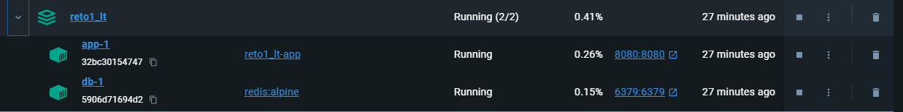

# Configuracion de JAVA JDK 21

Se instala el Binario de OpenJDK de Adoptium en la version 21, se descarga desde el link: https://adoptium.net/es/temurin/releases/?os=windows&arch=x64&package=jdk

El paquete ZIP se lo descomprime en la carpeta opt y se crean las variables de entorno:

Con el comando java --version se muestra la version con la que se encuentra trabajando

# Como ejecutar la aplicacion
Para ejecutar la aplicacion  el usuario primero debera compilar el programa con el comando

<ol>
 <li>Compilar el programa</li>

 <em> ./gradlew clean build</em>

<li>Para ejecutar la aplicacion en un contenedor docker, debera ejecutar con docker compose con el siguiente comando</li>
</ol>
<ul>
<li>Primero debe crear la red ejecutando</li>

<em>docker network create network-retodz1</em>

<li>Luego para hacer correr el contenedor ejecutar:</li>

<em>docker compose up --build</em>

</ul>

# Como consumir los servicios
<ol>
 <li>Llamada POST del endpoint para ejecucion</li>

http://localhost:8080/api/v1/reto1/process

payload: {
    "name":"Daniel Zerain"
}

curl --location 'http://localhost:8080/api/v1/reto1/process' \
--header 'Content-Type: application/json' \
--data '{
    "name":"Nombre Persona"
}'

<li>Llamada POST del endpoint para ejecucion y persistencia en la base de datos </li>

http://localhost:8080/api/v1/reto1/process-persist

payload: {
    "name":"Daniel Zerain"
}

curl --location 'http://localhost:8080/api/v1/reto1/process-persist' \
--header 'Content-Type: application/json' \
--data '{
    "name":"Nombre Persona"
}'

<li>Llamada GET del endpoint para ejecucion</li>

http://localhost:8080/api/v1/reto1/process?name=daniel zerain

curl --location --request GET 'http://localhost:8080/api/v1/reto1/process?name=daniel%20zerain' \
--header 'Content-Type: application/json' \
--data '{
    "name":"Nombre Persona"
}'

<li>Endpoint Acutator</li>

Para obtener el estado de la aplicacion se habilito Actuator, para ver el estado debera hacer la llamada al endpoint

http://localhost:8080/api/v1/actuator/health

curl --location 'http://localhost:8080/api/v1/actuator/health

</ol>